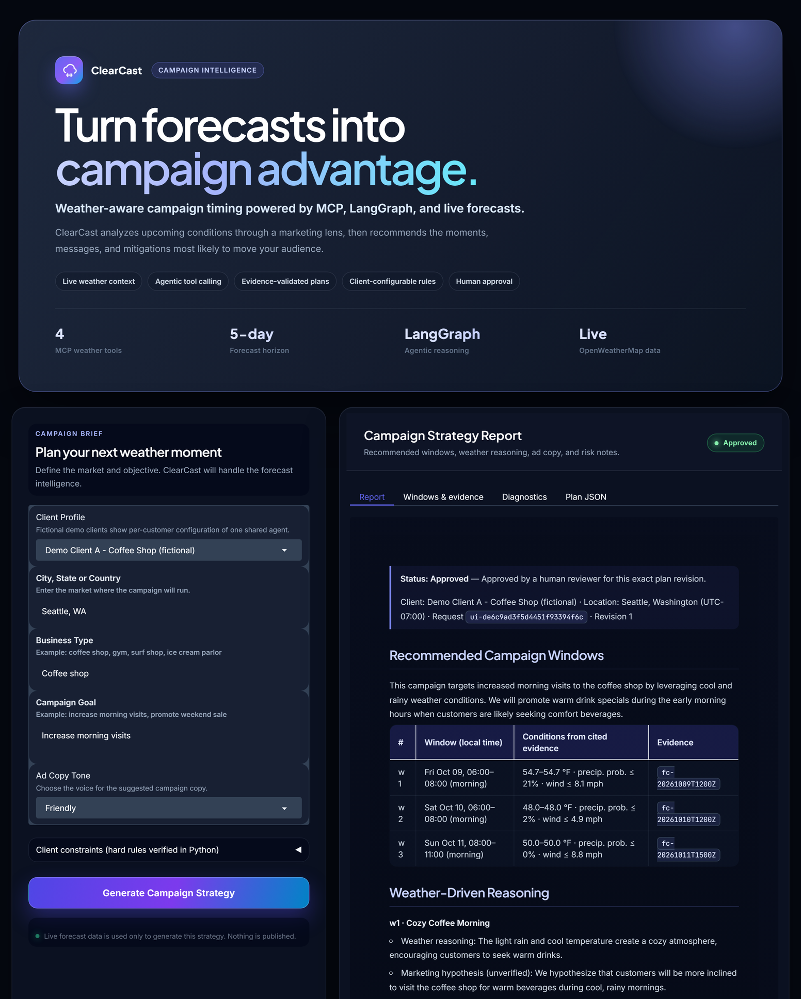
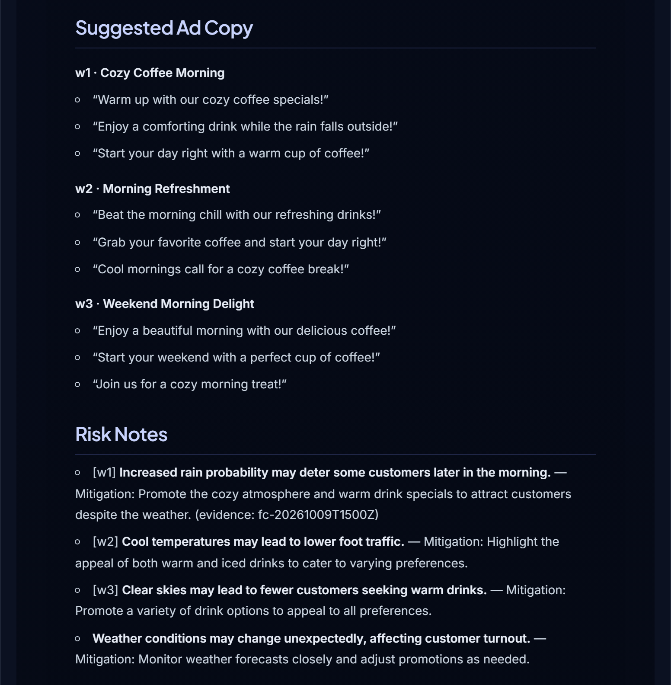
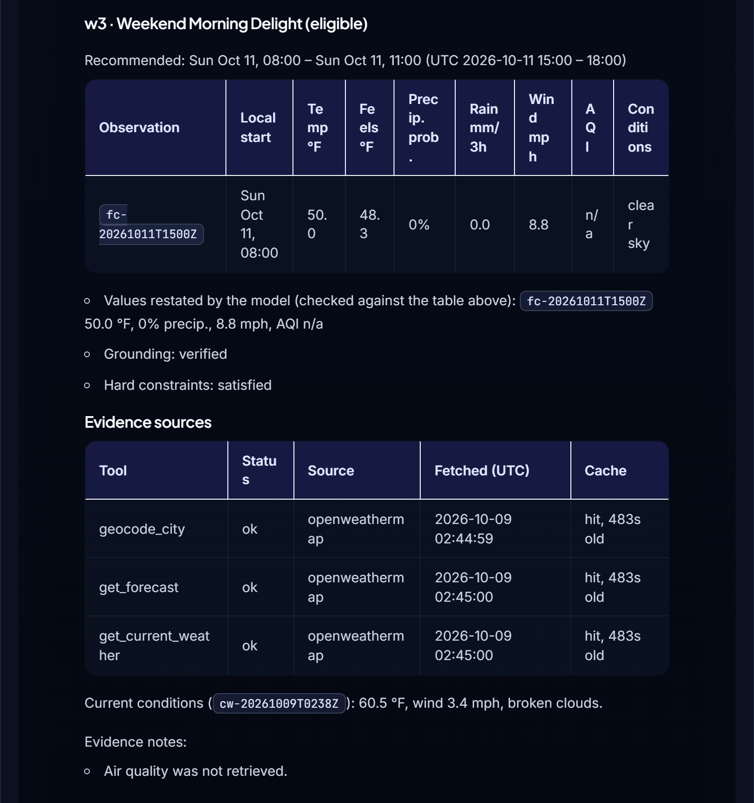
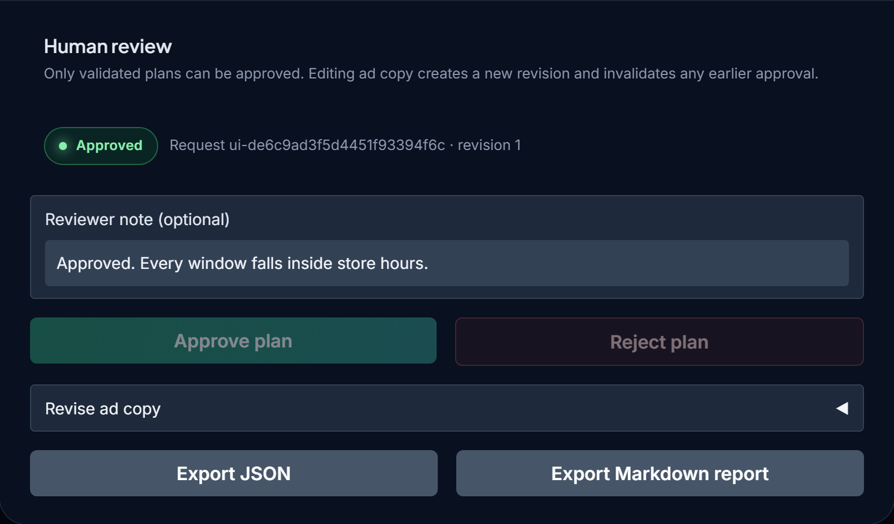
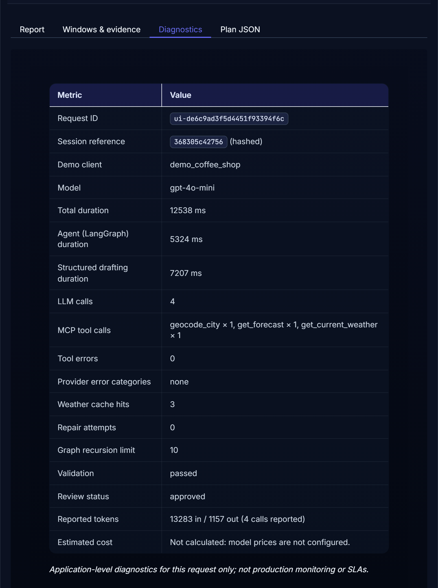
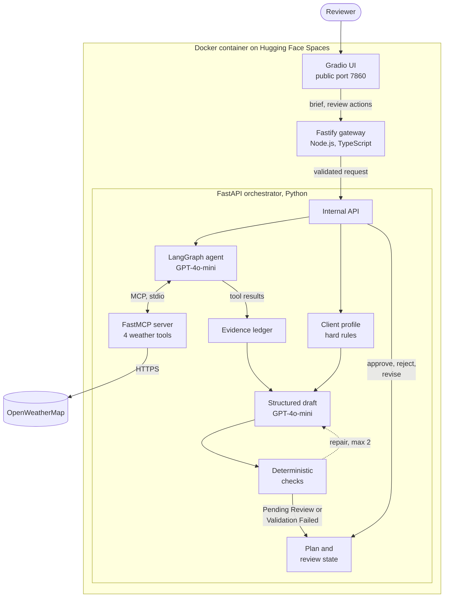

# ClearCast: Weather-Driven Agentic AI Campaign Planner

Weather changes what people want to buy, but a forecast on its own does not tell a small business when to run a promotion. ClearCast turns the forecast into that decision. You enter a market, a business type, a goal, and a tone, and it returns a short list of campaign windows for the next five days. Each window comes with the weather reasoning behind it, suggested ad copy, and risk notes, and each one is tied to the specific forecast observations it depends on.

I built ClearCast as a full-stack agentic AI application. A LangGraph agent running GPT-4o-mini gathers live OpenWeatherMap data through MCP tools, and the model drafts a structured campaign plan. I did not want to trust that draft on its own, so Python code checks every cited observation, every weather number, and every client rule before the plan reaches a person. Nothing is final until a human reviewer approves it.

**Live demo:** [huggingface.co/spaces/abhinavvathadi/ClearCast-AI](https://huggingface.co/spaces/abhinavvathadi/ClearCast-AI)

The two demo clients are fictional configurations. ClearCast suggests campaign timing and copy; it does not publish ads, and its output is not evidence of marketing results.

## Application preview

All screenshots were taken from the deployed Space using the fictional Coffee Shop client and live Seattle weather.

<p align="center">
  
</p>
<p align="center"><em>The campaign brief and the approved plan it produced. Every recommended window cites the forecast observation behind it.</em></p>

<p align="center">
  
</p>
<p align="center"><em>Suggested ad copy for each window, followed by risk notes and mitigations.</em></p>

<p align="center">
  
</p>
<p align="center"><em>Grounding details for one window. The Sunday window starts at 8 AM, which respects the client's late Sunday opening. Below it, each MCP tool call is listed with its fetch time and cache age.</em></p>

<p align="center">
  
</p>
<p align="center"><em>Human review after approval. The approval applies to this exact plan revision; editing the ad copy would reset it.</em></p>

<p align="center">
  
</p>
<p align="center"><em>Per-request diagnostics: model, timings, MCP tool calls, cache hits, repair attempts, validation result, and reported tokens.</em></p>

## Key capabilities

| Capability | What I implemented |
|---|---|
| Agentic retrieval | A LangGraph loop lets GPT-4o-mini decide which weather tools to call and in what order. A recursion limit bounds the loop, and any evidence gathered before the limit is kept. |
| MCP weather tools | Four tools (`geocode_city`, `get_current_weather`, `get_forecast`, `get_air_quality`) are discovered from a FastMCP server at runtime and converted from JSON Schema into Pydantic-backed LangChain tools. One persistent stdio session is shared and reconnects on failure. |
| Live weather data | OpenWeatherMap geocoding, current conditions, the 5-day forecast, and air quality, with timeouts, retries with backoff, `Retry-After` handling, and a short-lived cache that keeps each response's original fetch time. |
| Evidence-grounded plans | Python builds an evidence ledger from the tool results recorded for the current request. Every forecast block gets a stable ID such as `fc-20261009T1200Z`, and every recommended window must cite those IDs. |
| Validated structured output | The model drafts a plan in OpenAI's strict JSON-schema mode. Pydantic models define the plan and the API, and the gateway checks every response against JSON Schemas generated from them. |
| Deterministic checks | Python verifies cited IDs, window times, restated temperature, precipitation, wind, and AQI values, numbers in free text, evidence freshness, and hedged wording. Failures go back to the model as feedback, at most twice. A window that still fails is rejected on its own, and a plan with no verified window is marked Validation Failed. |
| Client rules | Hard constraints such as allowed hours, temperature range, rain probability, wind, AQI, and exclusion windows come from validated JSON profiles and are enforced in Python, so the model cannot override them. I included two fictional demo clients, a Coffee Shop and an Outdoor Fitness Studio, and the rules can be edited in the form. |
| Human review | Validated plans start as Pending Review. Approval is bound to a hash of the plan, and an ad-copy edit creates a new revision that must be approved again. Plans export as JSON or Markdown with their status included. |
| Session isolation | Each browser session gets a server-generated ID that maps to its own LangGraph thread and plan store. Another session cannot read or approve those plans. |
| Tracing and fault handling | Request IDs travel from the UI through the gateway to the orchestrator and into structured JSON logs. Provider failures map to categorized errors such as `model_timeout` and `model_rate_limited`, and every API error uses one envelope. LangSmith tracing is optional. |

## System architecture

The whole application runs in one Docker container, and only the Gradio UI is public. The Node.js gateway is the API boundary in front of the Python service. It validates payloads with TypeBox, enforces a 16 KiB body limit, applies per-session and global rate limits, propagates request IDs, maps upstream errors to a single error format, and rejects any orchestrator response that breaks the published contract. The FastAPI orchestrator owns the agent, the provider calls, validation, and review state.



Gathering evidence and drafting the plan are separate steps on purpose. The agent only collects data. The draft is written afterwards against a ledger that Python built from the recorded tool outputs, so the model never gets to supply its own evidence. Request flow, the agent loop, and the grounding rules are covered in detail in [docs/architecture.md](docs/architecture.md).

## Technology stack

| Area | Technologies |
|---|---|
| Frontend | Gradio Blocks with a custom theme |
| Backend and APIs | Node.js 22, TypeScript (strict), Fastify 5, TypeBox, Ajv; FastAPI, Pydantic, Uvicorn |
| Agentic AI | LangGraph, LangChain, OpenAI GPT-4o-mini, MCP Python SDK (FastMCP server and client bridge) |
| Data integration | OpenWeatherMap geocoding, current weather, forecast, and air quality APIs through httpx |
| Testing and evaluation | pytest, Vitest, an offline evaluation harness with synthetic weather and a scripted model server, Ruff, ESLint |
| Deployment and CI/CD | Docker (multi-stage build), Hugging Face Spaces (Docker SDK), GitHub Actions, a Python process supervisor |

Node.js is not just build tooling in this project. The Fastify gateway is a running backend service and the only route from the UI to the Python orchestrator. Both services validate the same request contract, and a shared fixture file runs against the TypeBox and Pydantic schemas in both test suites, so the two cannot drift apart without a test failing.

## How the application works

1. Write a brief. Choose a client profile or none, then enter a city, business type, campaign goal, and ad-copy tone. A profile loads its client rules into the form, where they can be adjusted.
2. Gather evidence. The request passes through the gateway to the orchestrator, where the agent geocodes the city and pulls the forecast and current conditions through MCP. It also fetches air quality for outdoor campaigns and whenever the client has an AQI rule.
3. Draft the plan. Python marks which forecast blocks satisfy the client's hard rules. GPT-4o-mini then writes windows, reasoning, ad copy, and risk notes in a strict JSON schema, citing observation IDs.
4. Check the draft. Grounding and rule checks run on every window. Failures go back for up to two repairs, windows that still fail are dropped with their reasons, and a plan with nothing left is returned as Validation Failed and cannot be approved.
5. Review and export. A reviewer reads the report, evidence, and diagnostics, then approves or rejects the plan and exports it as JSON or Markdown.

## Testing and evaluation

| Suite | Result |
|---|---|
| Python offline tests (pytest, mocked MCP, LangGraph, and providers) | 132 passed |
| Node.js gateway tests (Vitest) | 57 passed |
| Integration tests (real gateway, launcher, and MCP subprocess) | 8 passed |
| Offline evaluation | 45 of 45 scenarios passed |
| GitHub Actions CI | Lint, formatting, contract drift, secret scan, tests, evaluation, gateway type checks, integration tests, and a Docker build with a container smoke test |

The evaluation covers both demo clients across normal and extreme weather, conflicting constraints, invalid and malformed model output, OpenWeatherMap and model failures, session isolation, and review rules. Across those scenarios, all 32 recommended windows matched the raw weather data, and all 20 windows for constrained clients met their rules when rechecked independently of the app's own validator.

These results come from synthetic weather fixtures and scripted model behavior, and CI runs them without any provider credentials. They show that the software behaves correctly in the tested scenarios. They do not measure GPT-4o-mini's general accuracy, the usefulness of its recommendations, or real campaign performance. The methodology, scenario list, and metric definitions are in [docs/evaluation.md](docs/evaluation.md).

I also ran a live smoke test against the deployed Space with real GPT-4o-mini and OpenWeatherMap calls. It checks plan structure, evidence consistency, session isolation, approval, export, and credential leakage, and the results are recorded in [docs/deployment.md](docs/deployment.md).

## Run locally

You need Python 3.13, Node.js 22.12 or newer, an [OpenAI API key](https://platform.openai.com/api-keys), and a free [OpenWeatherMap API key](https://home.openweathermap.org/users/sign_up).

```bash
git clone https://github.com/AbhinavVarma02/ClearCast---Full-Stack-Agentic-AI-App-for-Weather-Driven-Marketing.git clearcast
cd clearcast
python -m venv .venv
source .venv/bin/activate              # Windows: .venv\Scripts\activate
pip install -r requirements.txt -r requirements-dev.txt
npm --prefix gateway ci
npm --prefix gateway run build
cp .env.example .env                   # then add OPENAI_API_KEY and OPENWEATHERMAP_API_KEY
python safe_env_check.py               # checks the OpenWeatherMap key without printing it
python app.py                          # starts the orchestrator, gateway, and UI
```

Then open http://127.0.0.1:7860. `python app.py` runs the same launcher as the container, which creates fresh internal tokens on every start and gives the provider keys only to the orchestrator.

To try the app without API keys, run it against synthetic weather and the scripted model server. Plans made this way are labeled `OFFLINE FIXTURE DATA`.

```bash
python -m evaluation.fake_openai_server --port 8099 &
CLEARCAST_WEATHER_FIXTURES=baseline_mild \
OPENAI_API_KEY=sk-offline-fixture-not-a-real-key \
OPENAI_BASE_URL=http://127.0.0.1:8099/v1 \
python app.py
```

To build and run the same image as the Space:

```bash
OPENAI_API_KEY=... OPENWEATHERMAP_API_KEY=... docker compose up --build
```

Run the tests:

```bash
python -m pytest                       # 132 offline tests
python -m pytest -m integration        # 8 integration tests (needs the built gateway)
npm --prefix gateway test              # 57 gateway tests
python -m evaluation.run_eval          # 45 offline evaluation scenarios
```

## Deployment

The live app runs on Hugging Face Spaces with the Docker SDK, configured by `sdk: docker` and `app_port: 7860` in the front matter of the Space's own README. The multi-stage `Dockerfile` builds the TypeScript gateway with Node.js, then copies it into a slim Python 3.13 image. Inside the container, `deploy/launcher.py` starts the FastAPI orchestrator, the Fastify gateway, and the Gradio UI in order, waits for each to report healthy, restarts a crashed process with backoff, and shuts everything down cleanly.

Only Gradio listens on the public port. The gateway (127.0.0.1:8787) and the orchestrator (127.0.0.1:8001) stay on the container's loopback interface, and calls between the three services carry random tokens generated at boot. The OpenAI and OpenWeatherMap keys are stored as Space secrets. If the Space has been idle, the first visit can take a minute while it wakes up.

[docs/deployment.md](docs/deployment.md) has the container layout, the verification record for the live deployment, and the rollback steps.

## Limitations

- Session history and review state are kept in memory. A restart or a sleeping Space clears them, and they are not shared across replicas.
- There are no user accounts or authentication. Each browser session gets an unguessable ID on a public Space.
- Recommendation quality has not been evaluated by people, and there is no real-world campaign performance data. The marketing hypotheses in each plan are labeled as unverified.
- Local times use the single UTC offset OpenWeatherMap reports, so a daylight-saving change inside the 5-day window can shift times by an hour.
- AQI rules can only be checked within OpenWeatherMap's air-quality forecast, which covers about four days.

## Further documentation

| Document | Contents |
|---|---|
| [Architecture](docs/architecture.md) | Request flow, agent loop, evidence and grounding rules, client configuration, review states, reliability |
| [Evaluation](docs/evaluation.md) | Test setup, scenario categories, metric definitions, and what the results do not show |
| [Deployment](docs/deployment.md) | Container layout, secrets, live verification record, rollback |
| [Technical evidence report](docs/technical_evidence_report.md) | Each claim mapped to the code, tests, or deployment evidence behind it |

The repository is organized like this:

```text
agent/          LangGraph graph, MCP bridge, evidence ledger, validation, review, service
agent/config/   Fictional demo client profiles (validated JSON)
api/            Internal FastAPI service and contract export
contracts/      JSON Schemas generated from Pydantic, shared contract fixtures
deploy/         Single-container process supervisor
evaluation/     Scripted model, scenarios, evaluation runner, recorded results
frontend/       Gradio UI, theme, gateway client
gateway/        Node.js, TypeScript, and Fastify gateway with tests
mcp_server/     FastMCP weather server, OpenWeatherMap client, offline fixtures
scripts/        Secret scan and deployment smoke test
tests/          pytest unit, component, and integration suites
```
